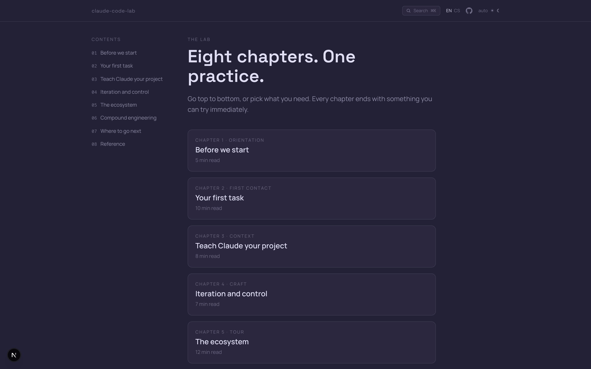

# claude-code-lab



**→ Live at [cc-lab.ondrejsvec.com](https://cc-lab.ondrejsvec.com)**

A hands-on guide to agentic coding with Claude Code — from install to compound. Bilingual (EN / CS), practice-oriented, with copyable prompts and sample projects you can run through the full loop.

Covers: install & auth, your first task, teaching Claude your project, iteration & control, the ecosystem, compound engineering, where to go next, a reference, and behind-the-scenes stats from building the lab itself.

## What's inside

- **`app/`** — public guide site (Next.js 16, Tailwind 4, Rosé Pine theme, dark/light)
- **`samples/python-react/`** — minimal Python + React sample project
- **`samples/dotnet-core/`** — minimal cross-platform .NET Core sample project
- **`skill/`** — companion Claude Code skill that walks through the lab from your terminal

## Running locally

```bash
pnpm install
pnpm dev
```

Open [http://localhost:3000](http://localhost:3000). The guide is public and needs no runtime environment variables.

## Scripts

```bash
pnpm dev          # dev server (Turbopack)
pnpm build        # production build
pnpm start        # run built app
pnpm lint         # eslint
pnpm test         # vitest unit
pnpm test:e2e     # playwright e2e
```

## Screenshots

See `scripts/capture/README.md` for the three capture families (CLI via
`freeze`, WEB via Playwright, DESK manual). Regenerate with:

```bash
./scripts/capture/generate-fixtures.py    # rebuild CLI ANSI fixtures
./scripts/capture/capture-cli.sh          # render CLI PNGs
./scripts/capture/capture-web.sh          # render WEB PNGs (needs pnpm dev)
```

## Design

Rosé Pine Dawn (light) / Moon (dark). Manrope body, Space Grotesk display. Lifted from the [Harness Lab](https://github.com/ondrej-svec) design system.

## License

MIT
