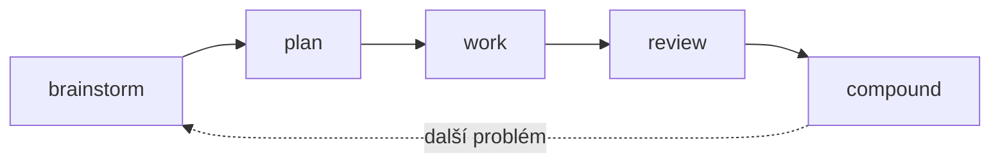

# Compound engineering

Nejužitečnější věc, kterou si po prvních čtyřech kapitolách můžeš nainstalovat, je **Compound Engineering plugin** od Averyho z Every. Zabaluje celou smyčku `brainstorm → plan → work → review → compound` jako slash příkazy, které pustíš na libovolný codebase.

Tahle kapitola je o tom, jak si ho nainstaluješ, jak ho použiješ, a proč se ta smyčka skládá sama na sebe.

## Smyčka v pěti příkazech

- `/brainstorm` — rozšiř problém, než ho začneš zužovat
- `/plan` — rozhodni, co stavět a v jakém pořadí, a napiš si to
- `/work` — vykonej plán, jednu atomickou změnu za druhou
- `/review` — druhé oči na výstup, proti plánu
- `/compound` — zapiš, co ses naučil, ať je příště levnější



*Každý průchod zanechá dokumenty, ze kterých čerpá další brainstorm a plán.*

Většina dev práce má takový tvar. Plugin ten tvar zviditelňuje — a dělá ho znovupoužitelným.

## Instalace

Dva kroky přímo v Claude Code:

```
/plugin marketplace add EveryInc/compound-engineering-plugin
/plugin install compound-engineering
```

První příkaz zaregistruje marketplace, druhý z něj plugin nainstaluje. Pokud ti víc sedí přímý zdroj, naklonuj [Compound Engineering repo](https://github.com/EveryInc/compound-engineering-plugin) a nasměruj Claude na lokální cestu.

Ověř:

```
/plan --help
```

Pokud tam ten příkaz je, jsi uvnitř.

## Použij to na něčem reálném

Vyber si úkol, na kterém bys tenhle týden pracoval. Ne hračku — něco, co má dost tvaru, aby se to dalo naplánovat. Menší feature, migraci, performance issue. Na to ta smyčka je.

**1. Brainstorm.** Začni s:

```
/brainstorm: chci přidat rate limiting na naše veřejné API
```

Neskákej rovnou k řešení. Nech Claude problém rozšířit — jaké provozní vzorce, jaký útočník, jaká cena. Většina hodnoty je v otázkách, které se ti Claude vrátí.

**2. Plán.** Když je problém jasný:

```
/plan
```

Claude napíše seznam úkolů s návaznostmi, uloží ho jako markdown soubor do `docs/plans/` a zastaví se. Přečti si ho. Uprav ho. Odsouhlas, až bys ho bez rozpaků předal kolegovi.

<Screenshot
  src="/screenshots/ch6-plan-output.png"
  alt="Příkaz /plan ukládá schválený plán do docs/plans/ s osmi úkoly ve třech fázích"
  caption="`/plan` uloží plán jako soubor. Projdeš ho, pak ho vykoná `/work`."
/>

**3. Práce.** Proti schválenému plánu:

```
/work
```

Claude odškrtává úkoly po jednom, commituje v malém, nebatchuje. Pokud tě něco v diffu překvapí, zastav se a uprav plán — neprotlačuj to.

**4. Review.** Když je hotovo:

```
/review
```

Claude si sám přečte svůj výstup proti plánu a označí, co chybí, co sklouzlo jinam, co potřebuje druhý pohled. Tohle zachytí zhruba 70 % těch „zkompilovalo se to, ale…" problémů.

**5. Compound.** Nakonec:

```
/compound
```

Claude napíše krátký dokument do `docs/solutions/` s problémem, fixem a tím, co nebylo zjevné. Tyhle dokumenty se stávají pamětí, ze které čerpá tvůj příští `/brainstorm` a `/plan`.

## Proč se ta smyčka skládá

Napoprvé ušetříš hodinu. Lineární.

Napodruhé už má `/compound` zanechané dokumenty v repu. Další `/brainstorm` je rychlejší, protože neznámých ubylo. Další `/plan` čerpá z toho předchozího.

Podesáté máš polovinu plánování napsanou předem. Skilly, které jsi vytáhl, odbavují rutinu. Řešíš nové problémy, místo aby ses probíral starými. To je ten compound.

## Co zkusit tenhle týden

1. Nainstaluj plugin
2. Vyber si jeden reálný úkol
3. Projdi celou smyčku — všech pět příkazů — i když se ti to zdá pomalé
4. Udělej to podruhé na jiném úkolu
5. Všimni si, co už je napsané po `/compound`

Dvě smyčky stačí, abys ten tvar ucítil. Pak už tě smyčka vede sama.
