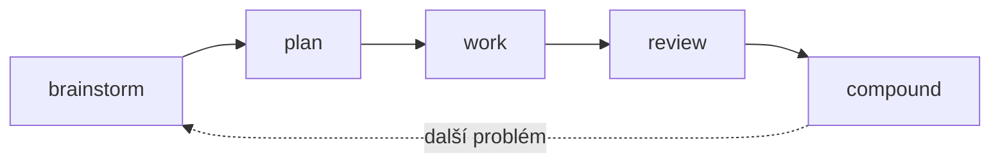

# Compound engineering

Nejužitečnější věc, kterou si po prvních čtyřech kapitolách můžeš nainstalovat, je **Compound Engineering plugin** od Averyho z Every. Zabaluje celou smyčku `brainstorm → plan → work → review → compound` jako slash příkazy, které pustíš na libovolný codebase.

Tahle kapitola je o tom, jak si ho nainstaluješ, jak ho použiješ, a proč se ta smyčka skládá sama na sebe.

## Smyčka v pěti příkazech

- `/brainstorm` — rozšiř problém, než ho začneš zužovat
- `/plan` — rozhodni, co stavět a v jakém pořadí, a napiš si to
- `/work` — vykonej plán, jednu atomickou změnu za druhou
- `/review` — druhé oči na výstup, proti plánu
- `/compound` — zapiš, co ses naučil, ať je příště levnější



*Každý průchod zanechá dokumenty, ze kterých čerpá další brainstorm a plán.*

Většina dev práce má takový tvar. Plugin ten tvar zviditelňuje — a dělá ho znovupoužitelným.

## Instalace

Dva kroky přímo v Claude Code:

```
/plugin marketplace add EveryInc/compound-engineering-plugin
/plugin install compound-engineering
```

První příkaz zaregistruje marketplace, druhý z něj plugin nainstaluje. Pokud ti víc sedí přímý zdroj, naklonuj [Compound Engineering repo](https://github.com/EveryInc/compound-engineering-plugin) a nasměruj Claude na lokální cestu.

Ověř:

```
/plan --help
```

Pokud příkaz je tam, jsi uvnitř.

## Použij to na něčem reálném

Vyber si úkol, na kterém bys tenhle týden pracoval. Ne hračku — něco, co má dost tvaru, aby se to dalo naplánovat. Menší feature, migraci, performance issue. Na to ta smyčka je.

**1. Brainstorm.** Začni s:

```
/brainstorm: chci přidat rate limiting na naše veřejné API
```

Neskákej rovnou k řešení. Nech Claude problém rozšířit — jaké provozní vzorce, jaký útočník, jaká cena. Většina hodnoty je v otázkách, které se ti Claude vrátí.

**2. Plán.** Když je problém jasný:

```
/plan
```

Claude napíše seznam úkolů s návaznostmi, uloží ho jako markdown soubor do `docs/plans/` a zastaví se. Přečti si ho. Uprav ho. Odsouhlas, až bys ho bez rozpaků předal kolegovi.

**3. Práce.** Proti schválenému plánu:

```
/work
```

Claude odškrtává úkoly po jednom, commituje v malém, nebatchuje. Pokud tě něco v diffu překvapí, zastav se a uprav plán — neprotlačuj to.

**4. Review.** Když je hotovo:

```
/review
```

Claude si sám přečte svůj výstup proti plánu a označí, co chybí, co sklouzlo jinam, co potřebuje druhý pohled. Tohle zachytí zhruba 70 % těch „zkompilovalo se to, ale…" problémů.

**5. Compound.** Nakonec:

```
/compound
```

Claude napíše krátký dokument do `docs/solutions/` s problémem, fixem a tím, co nebylo zjevné. Tyhle dokumenty se stávají pamětí, ze které čerpá tvůj příští `/brainstorm` a `/plan`.

## Proč se ta smyčka skládá

Napoprvé ušetříš hodinu. Lineární.

Napodruhé už má `/compound` zanechané dokumenty v repu. Další `/brainstorm` je rychlejší, protože neznámých ubylo. Další `/plan` čerpá z toho předchozího.

Podesáté máš polovinu plánování napsanou předem. Skilly, které jsi vytáhl, odbavují rutinu. Řešíš nové problémy, místo aby ses probíral starými. To je ten compound.

## Co zkusit tenhle týden

1. Nainstaluj plugin
2. Vyber si jeden reálný úkol
3. Projdi celou smyčku — všech pět příkazů — i když se ti to zdá pomalé
4. Udělej to podruhé na jiném úkolu
5. Všimni si, co už je napsané po `/compound`

Dvě smyčky stačí, abys ten tvar ucítil. Pak už tě smyčka vede sama.

---

## Postav si vlastní skill — agentním způsobem

Právě jsi použil cizí plugin, aby ti strukturoval práci. Teď z toho udělej návyk pro sebe: když se něco opakuje, extrahuj skill. **Ne tím, že napíšeš `SKILL.md` ručně.** Nech to Claude.

### Dva meta-skilly, které píšou skilly

Oba dělají totéž: provedou tě objevováním, sepíšou dobře tvarovaný `SKILL.md`, zapíšou ho na disk. Vyber si jeden.

- **`skill-creator`** — dodává Anthropic v repu [`anthropics/skills`](https://github.com/anthropics/skills). Instalace přes `/plugin` z toho marketplace. Kanonický zdroj, minimalistický, učí tvar.
- **`craft-skill`** — součást [Heart of Gold toolkitu](https://github.com/ondrej-svec/heart-of-gold-toolkit). Opiniated, pracuje v pěti fázích s technickým checklistem, vyrábí vyšší konformitu výchozím nastavením.

### Průchod

S jedním z nich nainstalovaným, v reálném projektu spusť:

```
/skill-creator
```

(nebo `/craft-skill`, podle toho, co máš).

Claude se bude ptát, jednu otázku po druhé:

1. **Co má ten skill dělat?** Jedna věta. *„Napsat release note naším hlasem ze seznamu mergovaných PR."*
2. **Kdy se má aktivovat?** Spouštěcí fráze. *„Když uživatel chce release note, changelog nebo ship note."*
3. **Kdo je uživatel?** Konkrétně. *„Já a engineering tým."*
4. **Jak vypadá úspěch?** Tvar výstupu. *„100–200 slov se třemi sekcemi: co se vydalo, na co dát pozor, co dál."*

Odpovídej co nejkonkrétněji. Vágní odpovědi dělají vágní skilly.

Claude pak napíše `SKILL.md` — frontmatter (`name`, `description`, `when_to_use`), fáze, příklady, anti-pattern. Ukáže ti diff. Ty zkontroluješ, upravíš, potvrdíš.

Soubor přistane v `~/.claude/skills/my-skill/SKILL.md`. Další session, když požádáš o release note, skill se sám aktivuje.

### Co Claude vyrobí

Frontmatter bude přibližně vypadat takto — je to tvar, který Claude napíše za tebe, ne šablona, kterou vyplňuješ:

```md
---
name: release-note
description: Napiš release note naším týmovým hlasem z mergovaných PR.
when_to_use: Když si někdo řekne o release note, changelog nebo ship note.
---

# Release note

Když uživatel chce release note:

1. Zeptej se na rozsah PR nebo seznam, pokud nejsou dané.
2. Přečti si title a description každého PR.
3. Rozděl do: co se vydalo · na co dát pozor · co dál.
4. Napiš 100–200 slov hlasem z `docs/voice.md`.
```

Skilly jsou pod 500 řádků. Delší obsah jde do přiložených souborů: `references/` pro materiály k čtení, `scripts/` pro pomocníky, `assets/` pro šablony. Tomuhle se říká *progresivní odhalování* — metadata se načítají vždy, tělo až když se skill aktivuje, extra soubory jen když jsou potřeba.

### Agent Skills otevřený formát

Formát je [otevřená specifikace](https://agentskills.io) — pole ve frontmatteru, chování loaderu, pravidla progresivního odhalování. Plná reference Anthropicu je v [anthropics/skills/spec/agent-skills-spec.md](https://github.com/anthropics/skills/blob/main/spec/agent-skills-spec.md). Skilly, které napíšeš, fungují v Claude Code dnes a budou fungovat v libovolném nástroji, co specifikaci zítra přijme.

### Skutečný endgame

Udělej to třikrát čtyřikrát — extrahuj skill, kdykoliv se něco opakuje — a najednou máš malou kolekci. Zabal je s `.claude-plugin/plugin.json`, publikuj na GitHub, a to je **tvůj plugin**. Stejný tvar jako Compound Engineering, jenom tvůj. Tvůj tým si ho nainstaluje jednou a zdědí všechno, co jsi se naučil systematizovat.

A to je compound engineering, až na dno.

→ [Skills docs](https://code.claude.com/docs/en/skills) · [Plugins docs](https://code.claude.com/docs/en/plugins)
