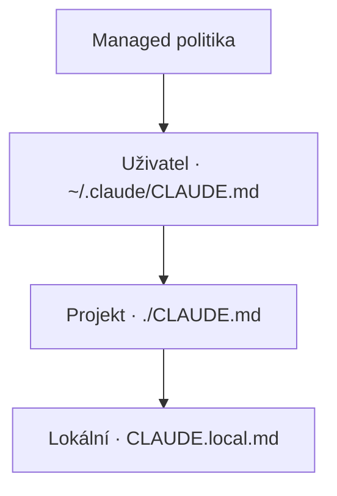

# Předej Claudovi kontext projektu

Claude si nepamatuje. Každá konverzace začíná z nuly. Dobrý `CLAUDE.md` mu dává zkratky, které by si jinak musel objevit znova — a díky tomu každý prompt dopadá lépe.

## Proč je kontext důležitější než model

Kvalita modelu je komoditizovaná. Rozdíl dělá **to, čím ho krmíš**. Slabší model s dobrým kontextem obvykle porazí silnější bez kontextu.

Tři failure módy, které poznáš:

1. "Dal mi kód, co ignoruje naše konvence" → neřekl jsi mu, jaké konvence máte
2. "Navrhl knihovnu, kterou nepoužíváme" → nevyjmenoval jsi, které používáte
3. "Pořád se ptá na věci, na které jsem už odpověděl" → nezapsal sis to

`CLAUDE.md` je místo, kam si to zapíšeš jednou. Až na to, že ho nepíšeš ty. Píše ho Claude.

## Nech Claude napsat návrh

V projektu spusť:

```
/init
```

Claude proskenuje repo a navrhne `CLAUDE.md` s tím, co našel — stack, struktura, běžné skripty, zjevné konvence. Pro novější interaktivní flow, co navíc navrhne skilly a hooky, nastav před spuštěním `CLAUDE_CODE_NEW_INIT=1`.

Výstup je **startovní bod, ne hotový dokument**. Teď požádej Claude, ať ho dolaďuje:

> Znovu si přečti `CLAUDE.md` a přidej tři konvence, které používáme — strict TypeScript bez `any`, testy vedle souboru, který pokrývají, databázové migrace jako číslované SQL soubory. Sekce nech krátké.

A pak:

> Znovu si přečti `CLAUDE.md` a přidej sekci **Ne** s pravidly, která pořád objevujeme znova — nesahej do `app/legacy/`, neinstaluj nové balíčky bez ptaní, nespouštěj migrace automaticky.

Claude soubor upraví a ukáže ti diff. Zkontroluj, potvrď, commitni. Dokument vyrostl tak, že jsi o pravidla **požádal**, ne tak, že jsi je do souboru **natypoval**.

## Jak to obvykle vypadá

Pokud tě zajímá tvar — takhle obvykle vypadá to, co Claude napíše. **Netypuj to**, nech Claude, ať to napíše z tvých odpovědí.

```md
# CLAUDE.md

## Projekt
Interní nástroj pro onboarding zákazníků. 3k DAU, Postgres + Node, deploy na Vercelu.

## Konvence
- TypeScript strict mode. Žádné `any` bez komentáře.
- Testy bydlí u souboru: `foo.ts` + `foo.test.ts`.
- Databázové migrace jsou číslované SQL soubory v `/db/migrations/`.

## Ne
- Neinstaluj nové npm balíčky bez ptaní.
- Nesahej do `app/legacy/` — to je zamražené, čeká na rewrite.
- Nespouštěj migrace automaticky.

## Užitečné příkazy
- `pnpm dev` — lokální server na :3000
- `pnpm test` — vitest, watch mode
- `pnpm db:seed` — reset lokální DB na fixture stav
```

**Cíl: pod 200 řádků na soubor.** Delší soubory spotřebovávají víc kontextu a snižují, jak dobře se jich Claude drží. Hlubší reference je v kapitole 8.4.

## Aktualizuj podle toho, co se učíš

Když tě Claude opraví, nemusíš zastavovat a ručně editovat `CLAUDE.md`. Stačí začít další zprávu znakem `#`:

> #migrace musí být reverzibilní — ke každému up napiš i down

To je **memory-add prefix**. Claude vezme text za `#`, rozhodne, do jakého rozsahu patří (projekt / uživatel / lokální), a přidá ho do správného `CLAUDE.md`. Zůstal jsi ve flow, pravidlo se zachytilo.

<Callout variant="tip">
Ber `CLAUDE.md` jako onboarding doc pro externistu — který musí být rychle produktivní, nezná tvoji historii a pracuje v osmihodinových blocích.
</Callout>

## Rozsah: projekt, uživatel, lokální

Tři soubory, všechny se při startu Clauda v projektu zřetězí dohromady. Pořadí záleží — pozdější vítězí, pokud si pravidla odporují:

- **Uživatel** — `~/.claude/CLAUDE.md` — o **tobě**: preference editoru, shell návyky, tón. Načítá se pro každý projekt.
- **Projekt** — `./CLAUDE.md` nebo `./.claude/CLAUDE.md` — o **tomhle codebase**: konvence, příkazy, ne. Commitnuté, sdílené s týmem.
- **Lokální** — `./CLAUDE.local.md` — o **tobě v tomhle projektu**: lokální cesty, tajné klíče, rozdělaná práce. Gitignorované.

Vnořené `CLAUDE.md` soubory v podadresářích se načítají líně — jenom když Claude sahá do souboru uvnitř toho podadresáře. Užitečné pro monorepa. Alternativa: `.claude/rules/*.md` s `paths:` frontmatter, které se aktivují, jenom když se dotýkáš odpovídajících souborů.



*Všechny soubory se při startu session zřetězí. Při konfliktu vyhrává ten pozdější v řetězu.*

→ [Anthropic memory docs](https://code.claude.com/docs/en/memory) — kanonická reference.

## Zkus to

Otevři ukázkový projekt. Spusť `/init`. Přečti si, co Claude navrhnul. Pak ho požádej, ať přidá tři pravidla, která popisují, jak pracuješ **ty**. Pak přidej sekci **Ne** s jedním pravidlem, které jsi kolegovi zopakoval už víckrát. Ulož.

Tvůj další prompt bude vypadat jinak.
