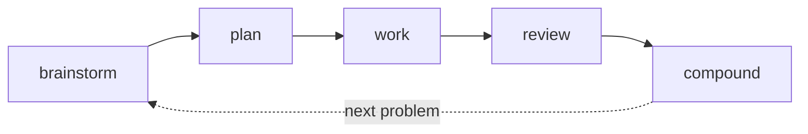

# Compound engineering

The single most useful thing you can install after the first four chapters is the **Compound Engineering plugin** by Avery from Every. It packages the full `brainstorm → plan → work → review → compound` loop as slash commands you can run against any codebase.

This chapter is how you install it, use it, and why the loop compounds.

## The loop in five commands

- `/brainstorm` — widen the problem before you narrow it
- `/plan` — decide what to build and in what order, written down
- `/work` — execute the plan, one atomic change at a time
- `/review` — second pass on the output, against the plan
- `/compound` — write down what you learned so next time is cheaper



*Each pass leaves documents the next brainstorm and plan will draw on.*

Most dev work fits this shape. The plugin makes the shape visible — and reusable.

## Install

Two steps from inside Claude Code:

```
/plugin marketplace add EveryInc/compound-engineering-plugin
/plugin install compound-engineering
```

The first command registers the marketplace; the second installs the plugin from it. If you prefer a direct source, clone the [Compound Engineering repo](https://github.com/EveryInc/compound-engineering-plugin) and point Claude at the local path.

Verify:

```
/plan --help
```

If the command is there, you're in.

## Use it on something real

Pick a task you'd work on this week. Not a toy — something with enough shape to plan. A small feature, a migration, a performance issue. This is what the loop is for.

**1. Brainstorm.** Start with:

```
/brainstorm: I want to add rate limiting to our public API
```

Don't skip to the solution. Let Claude widen the problem — what traffic patterns, what attacker model, what cost. Most of the value is in the questions it asks you back.

**2. Plan.** When the problem is clear:

```
/plan
```

Claude writes a task list with dependencies, saves it to a markdown file under `docs/plans/`, and stops. Read it. Edit it. Accept only when you'd hand it to a teammate without blushing.

<Screenshot
  src="/screenshots/ch6-plan-output.png"
  alt="/plan command writing an approved plan file to docs/plans/ with eight tasks across three phases"
  caption="`/plan` saves the plan as a file. You review it, then `/work` executes it."
/>

**3. Work.** Against the approved plan:

```
/work
```

Claude ticks tasks off one at a time, commits small, doesn't batch. If something surprises you in the diff, stop and update the plan — don't power through.

**4. Review.** When work is done:

```
/review
```

Claude reads its own output against the plan and surfaces what's missing, what drifted, what needs a second look. This catches ~70% of the "it compiles but…" class of problems.

**5. Compound.** Finally:

```
/compound
```

Claude writes a short doc to `docs/solutions/` with the problem, the fix, and what was non-obvious. These docs become the memory your next `/brainstorm` and `/plan` will draw on.

## Why the loop compounds

The first time through, you save an hour. Linear.

The second time, `/compound` has left docs in your repo. Your next `/brainstorm` is faster because the unknowns shrunk. Your next `/plan` references the prior one.

The tenth time, half of your planning is already written. The skills you've extracted handle routine work. You're spending time on new problems instead of rediscovering old ones. That's the compound.

## Practice: continue your sample

Working through the lab in order? Take what this chapter taught to the sample you started in chapter 2 — or to a codebase of your own, where it'll land harder.

1. Pick a small real feature — on the samples, rate limiting on `/api/items`, request logging, or header-based auth. On your own repo, a feature you could ship in 30 minutes. Not a weekend project.
2. Run the loop, all five commands in order. `/brainstorm` first — let it widen the problem. Then `/plan`; read the plan before accepting. Then `/work`. Then `/review` against the plan. Then `/compound` to leave a doc behind.
3. Don't skip `/compound` just because the task was small. The compound doc is the point — that's what makes your next `/brainstorm` faster.

When it works: your sample has a shipped feature planned and reviewed the proper way, and you have one doc in `docs/solutions/` that didn't exist before. The next chapter's practice adds tests, security review, and optional CI to what you've built.
